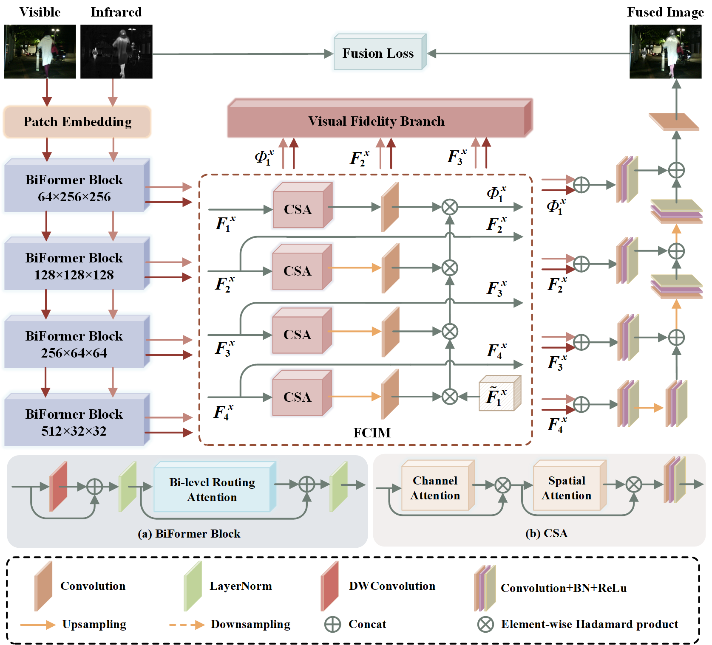

# Visual fidelity and full-scale interaction driven network for infrared and visible image fusion
⭐ This code has been completely released ⭐ 

⭐ our [article](https://doi.org/10.1016/j.patcog.2025.111612) ⭐ 

If our code is helpful to you, please cite:

```
@article{mei2025visual,
  title={Visual fidelity and full-scale interaction driven network for infrared and visible image fusion},
  author={Mei, Liye and Hu, Xinglong and Ye, Zhaoyi and Ye, Zhiwei and Xu, Chuan and Liu, Sheng and Lei, Cheng},
  journal={Pattern Recognition},
  volume={165},
  pages={111612},
  year={2025},
  publisher={Elsevier}
}
```
## To Train 
 ```
python train.py 
```

## To Test
1. Downloading the pre-trained checkpoint from [MSRS.pt](https://pan.baidu.com/s/1hs8tLULq83Zm8H0PEJZxJQ?pwd=rjvu).
2. python test.py

## overall network

<p align="center">  </p>


If you have any questions, please contact me by email (xinglonghu@whu.edu.cn).
